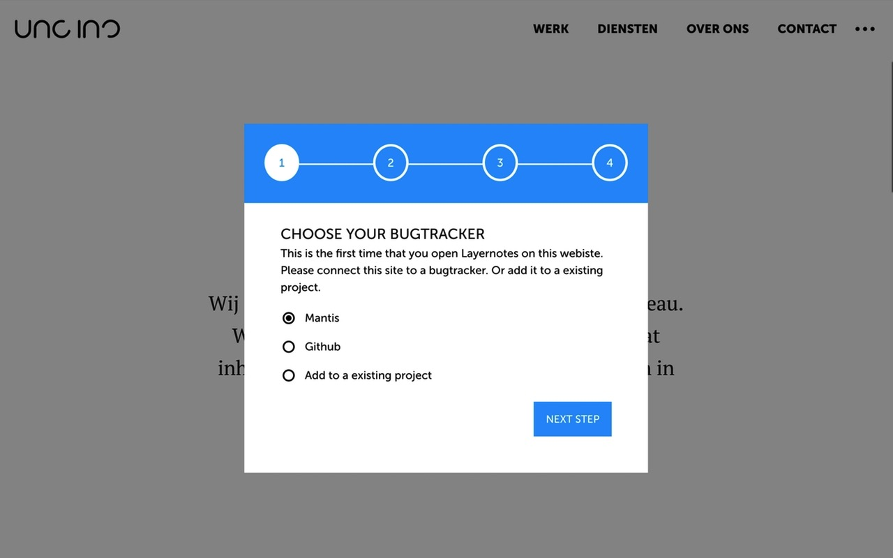

v0.4 (beta)

# Layer Notes
Layer Notes is a tool that you can use to easily create Tickets for the Bugtracker Mantis.

## Installation
1. Clone the repository `git clone git@github.com:uncinc/layer-notes.git`
2. Run `npm install`
3. Run `npm run build`

### Load the extension in Chrome & Opera
1. Open Chrome/Opera browser and navigate to [chrome://extensions](chrome://extensions)
2. Select "Developer Mode" and then click "Load unpacked extension..."
3. From the file browser, choose to `layer-notes/build/chrome` or `layer-notes/build/opera`.

### Load the extension in Firefox
1. Open Firefox browser and navigate to [about:debugging](about:debugging)
2. Click "Load Temporary Add-on" and from the file browser, choose `layer-notes/build/firefox`

## Developing
The following tasks can be used when you want to start developing the extension and want to enable live reload

- `npm run chrome-watch`
- `npm run opera-watch`
- `npm run firefox-watch`

## Packaging
Run `npm run dist` to create a zipped, production-ready extension for each browser. You can then upload that to the appstore.

## Screenshots
Some screenshots from the interface of the tool.

### The setup

### The interface of the tool

### Creating a ticket

### Editing a ticket

## TODO
- [ ] Make Github integration work
- [ ] Make background script API calls puggable
- [ ] Create documentation how to integrate a new bugtracker
- [ ] Fix number of bugs
- [ ] Add support for Safari
- [ ] Add support for Edge
- [ ] Add support for IE

## Contributions
You can contribute to Layer Notes in several ways:

### Contributing to the code
You can add new features and create a pull request to the tool to make it better.

### Translating the tool
In the folder `./src/_locales` you can find locales. With can use the english main file to translate it to your language. 

## Contributors

- [mat1th](https://github.com/mat1th)

## Licence
The code is licenced under the `GNU GENERAL PUBLIC LICENSE Version 3`
